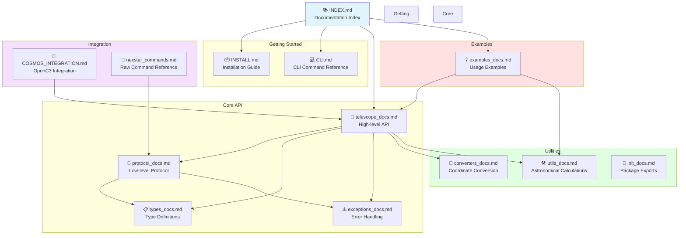

# Celestron NexStar Documentation Index

This directory contains detailed documentation for the Celestron NexStar Python library.

## Getting Started

- [Installation Guide](INSTALL.md) - How to install and set up the library
- [CLI Command Reference](CLI.md) - Command-line interface documentation

## User Guides

- [Data Import Guide](DATA_IMPORT.md) - How to import catalog data
- [Custom Catalog Guide](CUSTOM_CATALOG.md) - Creating custom catalogs
- [Custom YAML Feature](CUSTOM_YAML_FEATURE.md) - Using YAML catalogs
- [Catalog Data Sources](CATALOG_DATA_SOURCES.md) - Available catalog sources

## API Documentation

See the [api/](api/) directory for detailed API documentation:

- [Telescope API](api/telescope_docs.md) - High-level telescope control interface
- [Protocol Layer](api/protocol_docs.md) - Low-level NexStar serial communication protocol
- [Type Definitions](api/types_docs.md) - Enums, dataclasses, and type definitions
- [Exceptions](api/exceptions_docs.md) - Custom exception hierarchy
- [Converters](api/converters_docs.md) - Coordinate conversion utilities
- [Utilities](api/utils_docs.md) - Astronomical calculations and formatting
- [Module Initialization](api/init_docs.md) - Package exports and version info
- [Examples](api/examples_docs.md) - Code examples and common use cases
- [NexStar Commands](api/nexstar_commands.md) - Command reference

## Integration & Reference

- [COSMOS Integration](COSMOS_INTEGRATION.md) - Integration with COSMOS/OpenC3
- [TUI Framework Options](TUI_FRAMEWORK_OPTIONS.md) - Framework comparison for TUI

## Historical Documentation

See the [history/](history/) directory for completed migrations and phases.

## Future Plans

See the [plans/](plans/) directory for future feature roadmaps.

## Quick Links

- [Main README](../README.md) - Project overview and quick start
- [PyPI Package](https://pypi.org/project/celestron-nexstar/) - (when published)
- [Source Code](https://github.com/mcosgriff/celestron-nexstar) - (update with your repo)

## Documentation Organization



### Directory Structure

```text
docs/
├── INDEX.md              # This file
├── INSTALL.md           # Installation instructions
├── CLI.md               # CLI command reference
├── telescope_docs.md    # NexStarTelescope class documentation
├── protocol_docs.md     # NexStarProtocol class documentation
├── types_docs.md        # Type definitions (enums, dataclasses)
├── exceptions_docs.md   # Exception classes
├── converters_docs.md   # Coordinate converters
├── utils_docs.md        # Utility functions
├── init_docs.md         # Package initialization
├── examples_docs.md     # Usage examples
├── COSMOS_INTEGRATION.md # COSMOS/OpenC3 integration guide
└── nexstar_commands.md  # Raw command reference
```

## Contributing

See the main [README](../README.md) for information about contributing to this project.
