# Celestron NexStar Documentation Index

This directory contains detailed documentation for the Celestron NexStar Python library.

## Getting Started

- [Installation Guide](INSTALL.md) - How to install and set up the library

## API Documentation

### Core Modules

- [Telescope API](telescope_docs.md) - High-level telescope control interface
- [Protocol Layer](protocol_docs.md) - Low-level NexStar serial communication protocol
- [Type Definitions](types_docs.md) - Enums, dataclasses, and type definitions
- [Exceptions](exceptions_docs.md) - Custom exception hierarchy
- [Converters](converters_docs.md) - Coordinate conversion utilities
- [Utilities](utils_docs.md) - Astronomical calculations and formatting
- [Module Initialization](init_docs.md) - Package exports and version info

## Examples

- [Example Usage](examples_docs.md) - Code examples and common use cases

## Quick Links

- [Main README](../README.md) - Project overview and quick start
- [PyPI Package](https://pypi.org/project/celestron-nexstar/) - (when published)
- [Source Code](https://github.com/mcosgriff/celestron-nexstar) - (update with your repo)

## Documentation Organization

```mermaid
graph TD
    INDEX[📚 INDEX.md<br/>Documentation Index]

    subgraph Getting Started
        INSTALL[📦 INSTALL.md<br/>Installation Guide]
    end

    subgraph Core API
        TEL[🔭 telescope_docs.md<br/>High-level API]
        PROTO[📡 protocol_docs.md<br/>Low-level Protocol]
        TYPES[📋 types_docs.md<br/>Type Definitions]
        EXC[⚠️ exceptions_docs.md<br/>Error Handling]
    end

    subgraph Utilities
        CONV[🔄 converters_docs.md<br/>Coordinate Conversion]
        UTILS[🛠️ utils_docs.md<br/>Astronomical Calculations]
        INIT[🎯 init_docs.md<br/>Package Exports]
    end

    subgraph Examples
        EXAMPLES[💡 examples_docs.md<br/>Usage Examples]
    end

    subgraph Integration
        COSMOS[🚀 COSMOS_INTEGRATION.md<br/>OpenC3 Integration]
        COMMANDS[📖 nexstar_commands.md<br/>Raw Command Reference]
    end

    INDEX --> INSTALL
    INDEX --> TEL
    INDEX --> EXAMPLES

    TEL --> PROTO
    TEL --> TYPES
    TEL --> EXC

    PROTO --> TYPES
    PROTO --> EXC

    TEL --> CONV
    TEL --> UTILS

    EXAMPLES --> TEL
    EXAMPLES --> UTILS

    COSMOS --> TEL
    COMMANDS --> PROTO

    style INDEX fill:#e1f5ff
    style Getting Started fill:#fff4e1
    style Core API fill:#ffe1f5
    style Utilities fill:#e1ffe1
    style Examples fill:#ffe1e1
    style Integration fill:#f5e1ff
```



### Directory Structure

```text
docs/
├── INDEX.md              # This file
├── INSTALL.md           # Installation instructions
├── telescope_docs.md    # NexStarTelescope class documentation
├── protocol_docs.md     # NexStarProtocol class documentation
├── types_docs.md        # Type definitions (enums, dataclasses)
├── exceptions_docs.md   # Exception classes
├── converters_docs.md   # Coordinate converters
├── utils_docs.md        # Utility functions
├── init_docs.md         # Package initialization
├── examples_docs.md     # Usage examples
├── COSMOS_INTEGRATION.md # COSMOS/OpenC3 integration guide
└── nexstar_commands.md  # Raw command reference
```

## Contributing

See the main [README](../README.md) for information about contributing to this project.
