# Custom Exceptions (`exceptions.py`)

## Overview

This module defines a comprehensive set of custom exception classes for handling errors that may occur during telescope operations, database operations, data imports, and other system functions. All custom exceptions inherit from the base `NexstarError` class, allowing for easy and specific error handling.

## Exception Hierarchy

```mermaid
classDiagram
    Exception <|-- NexstarError
    NexstarError <|-- TelescopeConnectionError
    NexstarError <|-- TelescopeTimeoutError
    NexstarError <|-- InvalidCoordinateError
    NexstarError <|-- CommandError
    NexstarError <|-- NotConnectedError
    NexstarError <|-- DatabaseError
    NexstarError <|-- DataImportError
    NexstarError <|-- EphemerisError
    NexstarError <|-- LocationError
    NexstarError <|-- ISSTrackingError
    NexstarError <|-- ConfigurationError

    DatabaseError <|-- DatabaseNotFoundError
    DatabaseError <|-- DatabaseBackupError
    DatabaseError <|-- DatabaseRestoreError
    DatabaseError <|-- DatabaseRebuildError
    DatabaseError <|-- DatabaseMigrationError

    DataImportError <|-- CatalogNotFoundError
    DataImportError <|-- InvalidCatalogFormatError
    DataImportError <|-- DataImportFailedError

    EphemerisError <|-- EphemerisFileNotFoundError
    EphemerisError <|-- EphemerisDownloadError
    EphemerisError <|-- UnknownEphemerisObjectError

    LocationError <|-- LocationNotFoundError
    LocationError <|-- GeocodingError
    LocationError <|-- LocationNotSetError

    ISSTrackingError <|-- TLEFetchError
    ISSTrackingError <|-- ISSCalculationError

    ConfigurationError <|-- InvalidConfigurationError
    ConfigurationError <|-- ConfigurationNotFoundError

    class Exception {
        <<built-in>>
    }

    class NexstarError {
        <<base exception>>
        +message: str
    }
```



## Exception Classes

### Base Exception

- **`NexstarError`**: The base exception class for all errors in this library. You can use this to catch any telescope-related error.

### Telescope Exceptions

- **`TelescopeConnectionError`**: Raised when a connection to the telescope cannot be established. This can happen if the serial port is incorrect, already in use, or if the telescope is not physically connected.

- **`TelescopeTimeoutError`**: Raised when a command sent to the telescope does not receive a response within the specified timeout period. This may indicate that the telescope is not powered on or is busy.

- **`InvalidCoordinateError`**: Raised when provided coordinates are outside their valid ranges (e.g., RA outside 0-24 hours, Dec outside -90 to +90 degrees).

- **`CommandError`**: Raised when a command fails or the telescope returns an unexpected or unparsable response.

- **`NotConnectedError`**: Raised when an attempt is made to send a command to the telescope before a connection has been established or after it has been disconnected.

### Database Exceptions

- **`DatabaseError`**: Base exception for database-related errors.

- **`DatabaseNotFoundError`**: Raised when database file or backup file doesn't exist.

- **`DatabaseBackupError`**: Raised when backup operations fail.

- **`DatabaseRestoreError`**: Raised when restore operations fail.

- **`DatabaseRebuildError`**: Raised when database rebuild fails.

- **`DatabaseMigrationError`**: Raised when Alembic migrations fail.

### Data Import Exceptions

- **`DataImportError`**: Base exception for data import errors.

- **`CatalogNotFoundError`**: Raised when a catalog file or source is not found.

- **`InvalidCatalogFormatError`**: Raised when catalog data format is invalid.

- **`DataImportFailedError`**: Raised when data import fails (e.g., RSS feed fetch failures).

### Ephemeris Exceptions

- **`EphemerisError`**: Base exception for ephemeris-related errors.

- **`EphemerisFileNotFoundError`**: Raised when ephemeris file doesn't exist or is unknown.

- **`EphemerisDownloadError`**: Raised when ephemeris download fails (e.g., HTTP errors).

- **`UnknownEphemerisObjectError`**: Raised when planet/moon name is unknown or ephemeris set is invalid.

### Location/Observer Exceptions

- **`LocationError`**: Base exception for location-related errors.

- **`LocationNotFoundError`**: Raised when location cannot be found via geocoding.

- **`GeocodingError`**: Raised when geocoding API fails.

- **`LocationNotSetError`**: Raised when location is required but not set.

### ISS Tracking Exceptions

- **`ISSTrackingError`**: Base exception for ISS tracking errors.

- **`TLEFetchError`**: Raised when TLE (Two-Line Element) data cannot be fetched.

- **`ISSCalculationError`**: Raised when ISS position calculations fail.

### Configuration Exceptions

- **`ConfigurationError`**: Base exception for configuration errors.

- **`InvalidConfigurationError`**: Raised when configuration is invalid.

- **`ConfigurationNotFoundError`**: Raised when configuration file doesn't exist.

## Usage Examples

### Catching Specific Exceptions

```python
from celestron_nexstar.api.core.exceptions import (
    DatabaseNotFoundError,
    DatabaseRebuildError,
    LocationNotSetError,
)

try:
    rebuild_database()
except DatabaseNotFoundError:
    console.print("[yellow]Database not found. Creating new database...[/yellow]")
    init_database()
except DatabaseRebuildError as e:
    console.print(f"[red]Rebuild failed: {e}[/red]")
    if backup_path:
        console.print("[cyan]Restoring from backup...[/cyan]")
        restore_database(backup_path)
except DatabaseError as e:
    console.print(f"[red]Database error: {e}[/red]")
```

### Catching Base Exception Categories

```python
from celestron_nexstar.api.core.exceptions import (
    LocationError,
    GeocodingError,
    LocationNotFoundError,
)

try:
    location = geocode_location("New York, NY")
except LocationNotFoundError:
    console.print("[yellow]Location not found. Please try a different query.[/yellow]")
except GeocodingError as e:
    console.print(f"[red]Geocoding service error: {e}[/red]")
except LocationError as e:
    # Catches any location-related error
    console.print(f"[red]Location error: {e}[/red]")
```

### Catching All Nexstar Errors

```python
from celestron_nexstar.api.core.exceptions import NexstarError

try:
    # Any operation that might raise a Nexstar error
    telescope.slew_to_ra_dec(18.5, 38.8)
except NexstarError as e:
    # Catches all custom exceptions
    console.print(f"[red]Error: {e}[/red]")
```

## Migration Guide

If you have existing code that catches generic exceptions, consider updating to use specific exceptions:

### Before

```python
try:
    backup_database()
except FileNotFoundError:
    # Handle missing database
    pass
except RuntimeError as e:
    # Handle rebuild failure
    pass
```

### After

```python
from celestron_nexstar.api.core.exceptions import (
    DatabaseNotFoundError,
    DatabaseRebuildError,
)

try:
    backup_database()
except DatabaseNotFoundError:
    # Handle missing database
    pass
except DatabaseRebuildError as e:
    # Handle rebuild failure
    pass
```

## Benefits

1. **Better Error Handling**: More specific exceptions allow for targeted error handling and better user experience.

2. **Improved Code Clarity**: Explicit exceptions document what can go wrong, making code intent clearer.

3. **Easier Debugging**: Stack traces show specific exception types, making it easier to identify root causes.

4. **Better Logging and Monitoring**: Specific exception types enable better error tracking and monitoring.
