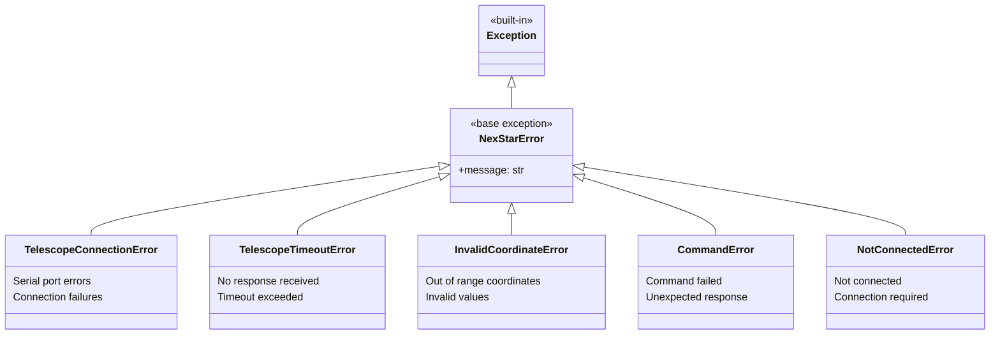

# Custom Exceptions (`exceptions.py`)

## Overview

This module defines a set of custom exception classes for handling errors that may occur during telescope operations. All custom exceptions inherit from the base `NexStarError` class, allowing for easy and specific error handling.

## Exception Hierarchy

## Exception Classes

- **`NexStarError`**: The base exception class for all errors in this library. You can use this to catch any telescope-related error.

- **`TelescopeConnectionError`**: Raised when a connection to the telescope cannot be established. This can happen if the serial port is incorrect, already in use, or if the telescope is not physically connected.

- **`TelescopeTimeoutError`**: Raised when a command sent to the telescope does not receive a response within the specified timeout period. This may indicate that the telescope is not powered on or is busy.

- **`InvalidCoordinateError`**: Raised when provided coordinates are outside their valid ranges (e.g., RA outside 0-24 hours, Dec outside -90 to +90 degrees).

- **`CommandError`**: Raised when a command fails or the telescope returns an unexpected or unparsable response.

- **`NotConnectedError`**: Raised when an attempt is made to send a command to the telescope before a connection has been established or after it has been disconnected.
